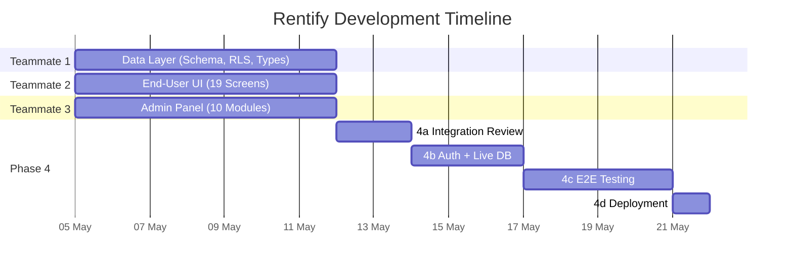
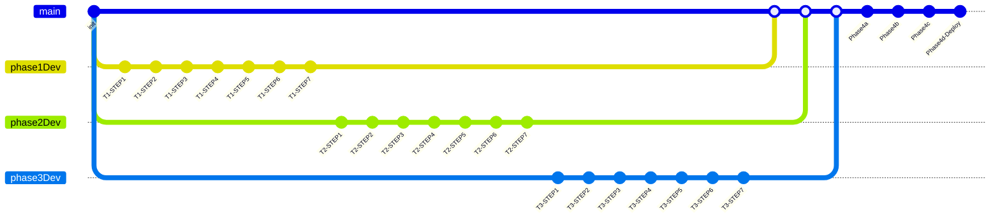

# RENTIFY — Workflow & Timeline

**Document Status:** FINAL  
**Applicable To:** All Teammates & Phases

---

## Timeline Overview

**Total Duration:** 17 working days  
**Model:** 7-7-7-10 (Three parallel phases + one sequential integration phase)

```
Days  1-7:   Phase 1 (T1) + Phase 2 (T2) + Phase 3 (T3) — PARALLEL
Days  8-9:   Phase 4a — Integration Review
Days 10-12:  Phase 4b — Auth + Live Database
Days 13-16:  Phase 4c — End-to-End Testing
Day  17:     Phase 4d — Deployment
```

---

## Phase Diagram



---

## Phase Descriptions

### Phase 1 — Teammate 1: Data Layer (Days 1-7)
**Branch:** `phase1Dev`  
**Owner:** T1  
**Deliverables:**
- Supabase project setup
- All 12+ database tables with constraints and indexes
- Row-Level Security policies on all tables
- TypeScript strict type definitions (`/src/types/database.ts`)
- Supabase client setup (`/src/lib/supabase.ts`)
- Calculation engines (`/src/lib/engines.ts`) — pricing, deposits, late fees, payouts
- Color token exports (`/src/lib/colors.ts`)
- Mock data seeding for development

### Phase 2 — Teammate 2: End-User UI (Days 1-7)
**Branch:** `phase2Dev`  
**Owner:** T2  
**Deliverables:**
- Auth screens (Login, Register, Forgot Password)
- Dashboard with stats, notifications, quick actions
- Product browsing, search, filters, category navigation
- Product detail with image gallery, pricing table, date picker
- 3-step booking checkout flow + cart
- Order management (renter view + order detail)
- Lister screens (listings, create listing, order requests)
- Pickup/return flows with photo capture UI
- Dispute/damage claim screen
- All screens using mock data (swappable in Phase 4)

### Phase 3 — Teammate 3: Admin Panel (Days 1-7)
**Branch:** `phase3Dev`  
**Owner:** T3  
**Deliverables:**
- Admin layout shell with sidebar navigation
- Admin dashboard (KPIs, revenue chart, activity feed)
- User management module
- Product listing management
- Order management (admin view)
- Delivery management
- Dispute management with photo comparison
- Payout management with hold timers
- Financial reports with export
- Platform configuration (Super Admin only)
- Role & permission management
- All modules using mock data (swappable in Phase 4)

### Phase 4 — Integration & Deployment (Days 8-17)
**Branch:** `main`  
**Owners:** All 3 teammates + Nitin + Claude

#### Phase 4a: Integration Review (Days 8-9)
- Merge all 3 branches to `main`
- Resolve merge conflicts
- API contract alignment between UI and data layer
- Code review across all components

#### Phase 4b: Auth + Live Database (Days 10-12)
- Replace all mock data with real Supabase API calls
- Connect authentication flow to Supabase Auth
- Set up Nodemailer with Google SMTP
- Test all CRUD operations against live database
- Verify RLS policies work in real scenarios

#### Phase 4c: End-to-End Testing (Days 13-16)
- Full user journey testing (Renter, Lister, Admin)
- Edge case testing (late returns, disputes, payment plans)
- Performance testing (page load times, query optimization)
- Accessibility testing (WAVE, Axe DevTools, keyboard nav)
- Cross-browser testing (Chrome, Firefox, Safari, Edge)
- Mobile responsiveness testing

#### Phase 4d: Deployment (Day 17)
- Production build and optimization
- Environment variable configuration
- Deploy to Vercel (or self-hosted)
- DNS configuration
- Smoke testing on production
- Handoff documentation

---

## Sync Model

### During Days 1-7 (Parallel Phases)

**Communication:** Async via PROGRESS.md updates  
**Frequency:** After each step completion (daily)  
**Escalation:** Direct to Nitin (project lead)

```
DO:
✅ Update your PROGRESS.md after each step
✅ Commit after each step with standardized message
✅ Ask Nitin if you're blocked or unsure
✅ Use mock data to avoid dependencies

DON'T:
❌ Wait for another teammate
❌ Reference another teammate's workspace
❌ Share code between teammates
❌ Change the database schema without T1
```

### During Days 8-17 (Phase 4)

**Communication:** Sync — all teammates work together  
**Coordination:** Nitin orchestrates the integration  
**Decision Making:** Consensus preferred, Nitin is tie-breaker

---

## Commit Strategy

### Step-Wise Commits (Rollback Safety)

Each teammate makes exactly **7 commits** during Days 1-7, one per step.

```
Commit 1: [STEP-1] - Foundation setup
Commit 2: [STEP-2] - Core implementation
Commit 3: [STEP-3] - Extended features
Commit 4: [STEP-4] - Advanced features
Commit 5: [STEP-5] - Integrations
Commit 6: [STEP-6] - Polish & edge cases
Commit 7: [STEP-7] - Final testing & cleanup
```

**Rollback Process:**
- If STEP-5 fails → `git revert` to STEP-4 commit
- Only lose 1 day of work, not 5
- Fix the issue and re-commit STEP-5

### Phase 4 Commits
- Multiple commits allowed per sub-phase
- Use descriptive messages: `[PHASE4a] - Merged T1 and T2 branches`
- All commits go to `main` branch

---

## Branch Strategy



---

## Risk Mitigation

| Risk | Mitigation |
|------|-----------|
| Teammate falls behind | Extend by 1-2 days OR merge incomplete work |
| Merge conflicts in Phase 4 | Route groups isolate T2/T3; T1 owns `/src/lib` and `/src/types` |
| Mock data doesn't match schema | T1 publishes draft types early; T2/T3 adapt in Phase 4 |
| RLS blocks Phase 4b | T1 tests RLS extensively in Step 3; documented in PROGRESS.md |
| Deployment issues | Phase 4d has full day buffer; Vercel provides rollback |

---

**Document Version:** 1.0  
**Status:** FINAL  
**For:** Rentify P2P Rental Marketplace
